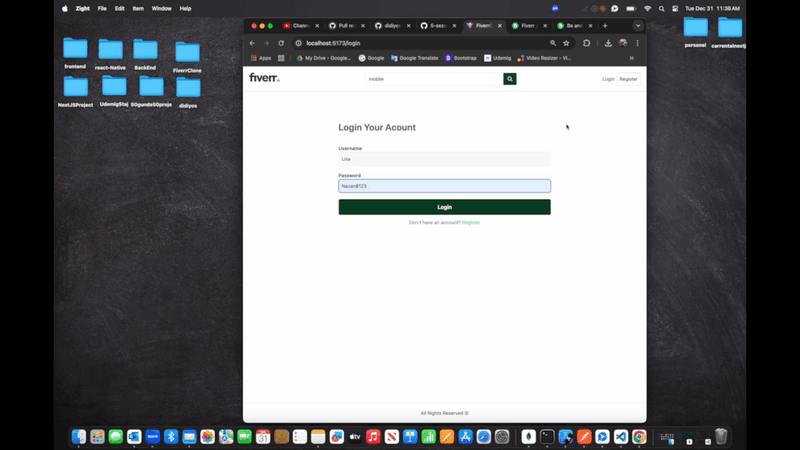

# # FullStack-Fiverr

- I did a study on Fiverr site for Fullstack project practice. You can add a new user. If you are a seller, you can create a new service. You can delete a service. You can search by title. You can search by category.

- Used packages;
- - for frontend; react/react-icons/react-router-dom/react-toastify/moment/axios/@tanstack/react-query/@splidejs/react-splide/tailwindcss
- - for backend; /mongoose/express/bcrypt/cookie-parser/cors/json-web-token/multer/cloudinary/dotenv

`npm run dev` for server
`nom run dev` for client

